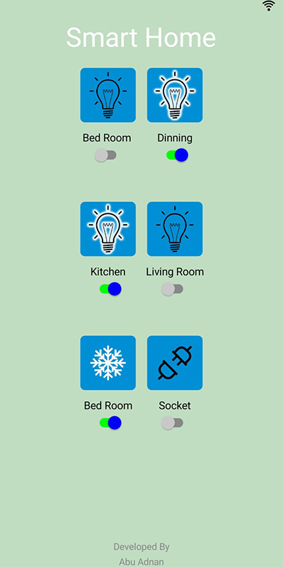
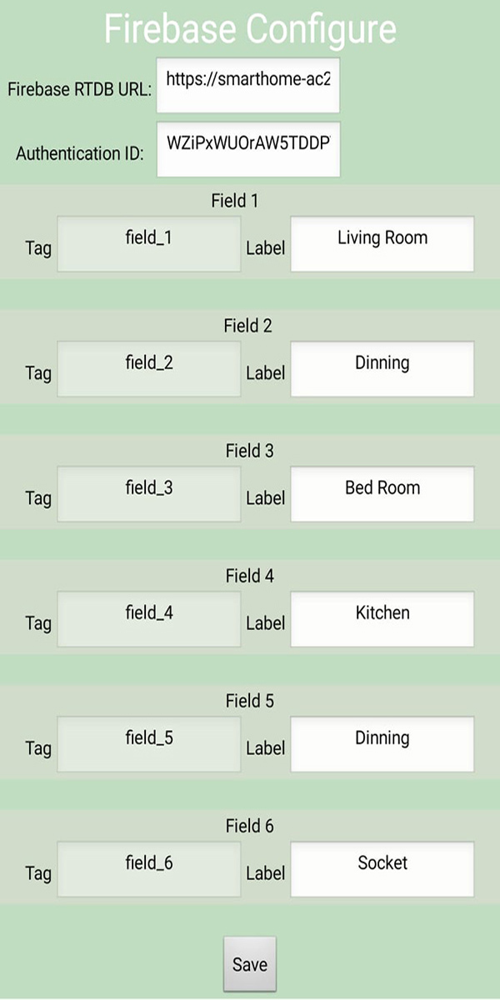

# Smart-Home-App
This app is designed to control IoT home appliances. Firebase Real time Database is used as database for this app.
<h4> Features </h4>
<ul>
  <li> 6 Appliance Control Switch</li>
  <li> Configurable Firebase Realtime Database</li>
</ul>
<h4> User Interface </h4>

<h4> Configuration Page </h4>

<h4> How to get Authentication Key</h4>
<ul>
  <li> Go to Firebase Console</li>
  <li> Select Project </li>
  <li> Go to Project Settings </li>
  <li> Go to Service Account </li>
  <li> Click Database Secrets </li>
  <li> Create a New Secret by clicking "Add Secret" </li>
  <li> Copy Secret Key and Paste it to Authenction Key Field in App </li>
  <b> DO NOT Share Database Secret Key and URL with anyone. </b>
</ul>
